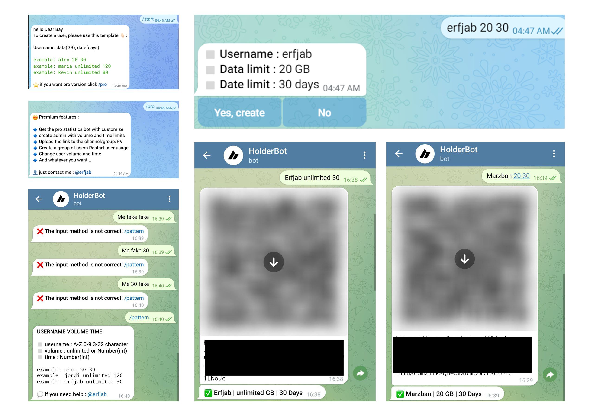

# What is holderbot ?
HolderBot is a fast and simple bot designed to address the absence of the `Start Timer After First Connection` option in the `Marzban Panel` frontend. By leveraging the Marzban Panel APIs, HoldrBot enables you to effortlessly utilize this functionality in Telegram.
# How to install ?
To install HolderBot, simply enter the following command on your ubuntu server.
```
None
```
Now that all the prerequisites are installed, you need to provide the following information to the bot for it to start.

| Data | Description |
| --- | --- |
| Admin userID | Telegram userID of the person who wants to use the bot. You can obtain from the [@aloidbot](https://t.me/aloidbot) bot. |
| Telegram bot token | You can obtain this from the [@BotFather](https://t.me/botfather)  bot. |
| Panel username | You can enter the username of the main or secondary admin. |
| Panel password | You can enter the password of the main or secondary admin. |
| Panel domine | Enter the subdomain of your panel, without 'https://' and port , just like : sub.domain.com |


If you have entered your information correctly, a message confirming the bot startup will appear for you. if yes so enjoy.
# How to use ?
All the necessary instructions will be received in Telegram after starting the bot. Enter the requested account information for the bot following this pattern: `Username volume Time` Then, it will ask for your confirmation. After receiving confirmation, it will send you a barcode and the text link for the created user. Also, a message containing the account details will be sent to you.

| Data | Description |
| --- | --- |
| username | text or number , no matter. |
| volume | How much GB ? |
| time | How many days? |

# ⭐ What is premium holderbot ?
+ Get the pro statistics bot with customize

+ Create admin with volume and time limits

+ Upload the link to the channel/group/PV

+ Create a group of users

+ Desired change of inbound configs
  
+ Restart user usage

+ Change user volume and time

+ Can restore nodes

+ And whatever you want...

**💬 if you want premium holderbot or need help , contact me on telegram : [@erfjab](https://t.me/erfjab)**

<p align="center">
  <a target="_blank" href="https://t.me/erfjab">
    
  </a>
  <a target="_blank" href="mailto:erfjab@gmail.com">
    
  </a>
</p>





