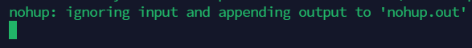
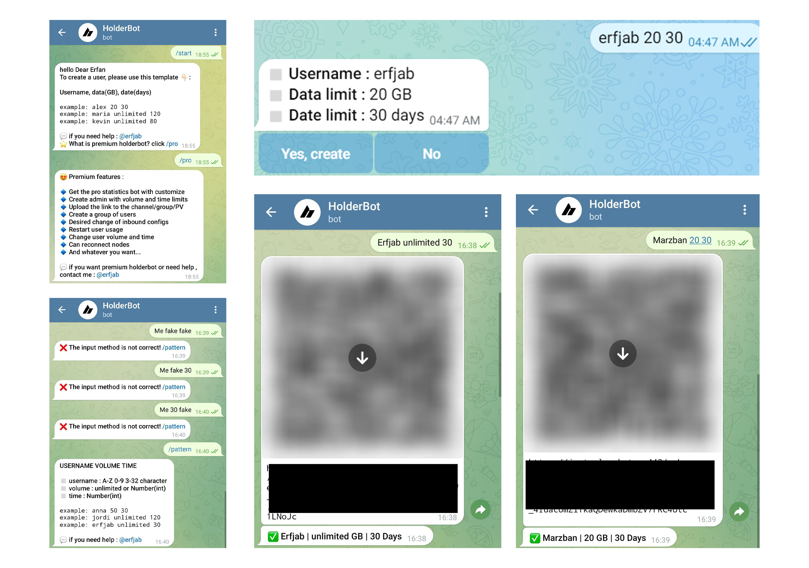

<p align="center">
 <a href="./README.md">
 English
 </a>
 /
 <a href="./README-fa.md">
 فارسی
 </a>
</p>

# What is holderbot ?
HolderBot is a fast and simple bot designed to address the absence of the `Start Timer After First Connection` option in the `Marzban Panel` frontend. By leveraging the Marzban Panel APIs, HoldrBot enables you to effortlessly utilize this functionality in Telegram.
# How to install ?
To install HolderBot, simply enter the following commands on your ubuntu server.
```
cd && cd ..
```

```
rm install.sh*
```

```
sudo apt install && sudo apt-get install libjpeg-dev && wget https://raw.githubusercontent.com/erfjab/holderbot/main/install.sh && chmod +x install.sh && ./install.sh
```

Now that all the prerequisites are installed, you need to provide the following information to the bot for it to start.

| Data | Description |
| --- | --- |
| Admin userID | Telegram userID of the person who wants to use the bot. You can obtain from the [@aloidbot](https://t.me/aloidbot) bot. |
| Telegram bot token | You can obtain this from the [@BotFather](https://t.me/botfather)  bot. |
| Panel username | You can enter the username of the main or secondary admin. |
| Panel password | You can enter the password of the main or secondary admin. |
| Panel domine | Enter the subdomain of your panel, without 'https://' and port , just like : sub.domain.com |

After completing the information, your page will look like this:



**Keep the page as it is and now test the bot; If your information is correct, the bot will create a user for you, and if it is not correct, it will not create a user.**
If the bot did not create a user for you, return to the page and run the following command. `CTRL + C`


Then go through the installation process again from the beginning, just be careful in completing your information.

**Now, if this time bot user made, then enjoy.** (Close the server without command.)

# New Future
To `update and add new features` to the bot, you can `give a star` to the HolderBot repository on GitHub. Additionally, for financial support, you can use this wallet address: `TNU42jETaCLg96Dw3Sdcjbrfq1AdHVu4Rr`. We appreciate all your support.

# How to use ? (Not completed)
All the necessary instructions will be received in Telegram after starting the bot. Enter the requested account information for the bot following this pattern: `Username volume Time` Then, it will ask for your confirmation. After receiving confirmation, it will send you a barcode and the text link for the created user. Also, a message containing the account details will be sent to you.

| Data | Description |
| --- | --- |
| username | text or number , no matter. (Marzban rules : A-Z 0-9 3-32 character) |
| volume | How much GB ? (Unlimited or Number(int))|
| time | How many days? (Number(int))|

> example: Alex 20 30

> example: anna 50 30

> example: jordi unlimited 120

> example: erfjab unlimited 30 


<p align="center">
  <a target="_blank" href="https://t.me/erfjab">
    
  </a>
  <a target="_blank" href="mailto:erfjab@gmail.com">
    
  </a>
</p>





